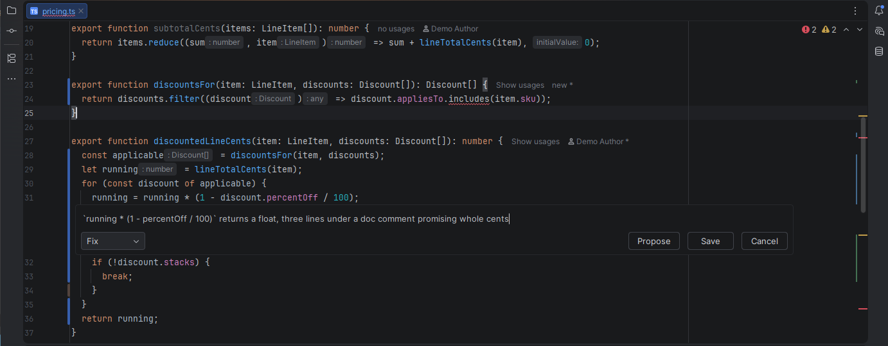
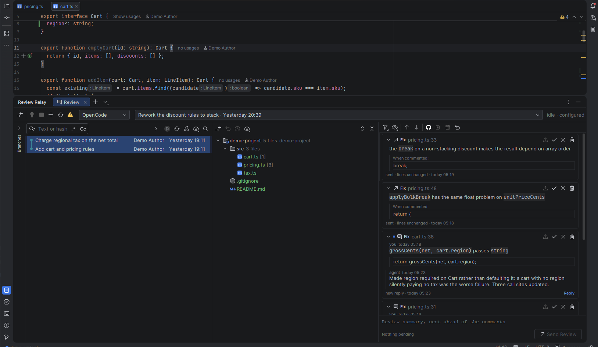
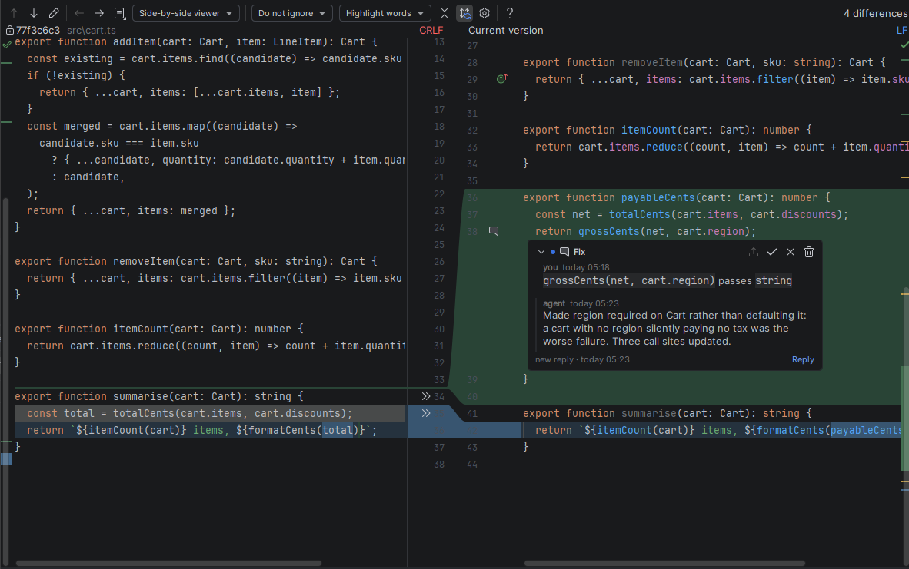
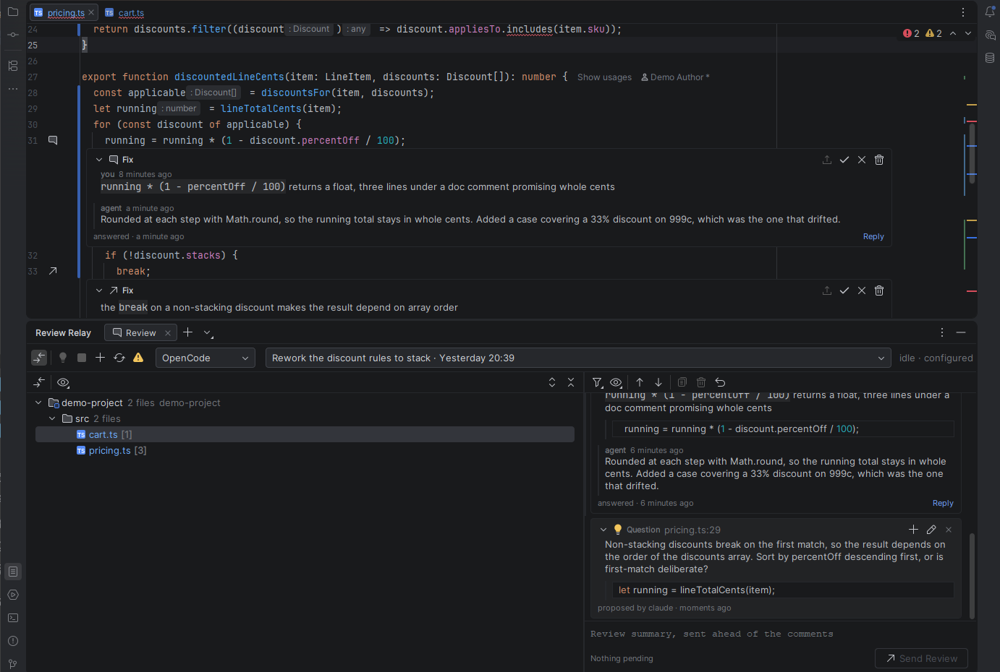

# Review Relay

Review what your coding agent wrote the way you review a pull request, without leaving IntelliJ.

See what the branch changed, leave inline comments on lines and ranges in the editor or the diff,
then hand the whole review to the agent. Each comment travels with the exact lines it refers to, so
the agent reads your note and the code together — and answers land back in the comment thread.



The review collects in its own tool window: every comment with the file and line it sits on, the code
it was written against, and what the agent has said back.



Comments anchor to lines, not to an editor, so the same comment is there in the diff.



An agent can propose a comment of its own. Proposals wait in a quiet inbox under your comments, to be
added to the review, reworded, or dismissed — nothing an agent proposes leaves the IDE unless you add
it.



## Backends

Review Relay talks to more than one kind of agent, and says honestly which it is doing.

| | **OpenCode** | **Claude Code** | **Any MCP client** |
|---|---|---|---|
| How the review gets there | pushed into a live session | pushed into a live session | published; the agent fetches it |
| Send button reads | Send Review | Send Review | Publish Review |
| Session picker | yes | yes | no — one implicit conversation |
| Knows the agent is working | yes | yes | no |
| Stop the agent | yes | no | no |
| Replies come back | yes | yes | yes |

Replies come back the same way whichever you pick: Review Relay serves two MCP tools of its own, so
what differs above is only how the review *reaches* the agent.

Pick the backend in the dropdown at the left of the tool window header. The choice is per project,
so one checkout can drive OpenCode while another drives Claude Code.

Anything the backend cannot do is **plainly unavailable rather than broken**: no session dropdown, a
greyed Stop button, and a status line that says nothing about the agent rather than guessing that it
is idle.

## Install

Needs **IntelliJ IDEA 2026.1+** with the bundled **Git** plugin enabled (it is by default).

1. Build the plugin with `./gradlew buildPlugin`, or take a `review-relay-<version>.zip` from a release.
2. **Settings → Plugins → ⚙ → Install Plugin from Disk…** and pick the zip.
3. Restart the IDE.
4. Open the **Review Relay** tool window at the bottom.

## Letting an agent reach the review

Review Relay serves its own MCP endpoint on the IDE's built-in web server, offering exactly four
tools:

- `review_comments` — the published review: every comment with its id, file, line range and text.
- `review_comment(id)` — one of them again, with everything said on it since, so a long job does not
  mean fetching the whole review twice.
- `review_reply(id, note)` — the agent's answer, recorded beside the comment it is about.
- `review_propose(file, lines, text)` — a comment of the agent's own, put in front of you to add to
  the review or dismiss. See [Proposals](#proposals).

Click **Set Up Agent Access** in the toolbar. It shows the address, says which of Claude Code,
OpenCode, Codex and Cursor already point at it, and gives you a snippet to paste for the ones that do
not. Restart the agent afterwards. The button wears a warning icon while nothing is configured,
because that is the state in which an answer has no way back.

This is deliberately *not* the IDE's own MCP server. That one publishes the whole IntelliJ tool
surface — terminal execution, refactoring, SQL — to whoever connects, is off by default, and binds a
call to a project by exact path, so a reply sent from a linked checkout never finds the project it
belongs to. Ours resolves one to the repository it shares, so either end works.

If the address shows as stale in that dialog, the built-in server took a different port because a
second IDE held the usual one; paste the new snippet.

### OpenCode

The review is pushed into a live session, so OpenCode also has to be reachable. The plugin finds a
server on its own, in this order:

1. the URL in **Settings → Tools → Review Relay**, if set;
2. the **OpenChamber desktop app**, whose local server re-exposes the OpenCode API under `/api`;
3. a **managed OpenCode server** listed in `~/.config/openchamber/managed-opencode/`;
4. `http://127.0.0.1:4096`, the default `opencode serve` port.

For 3 and 4 the password comes from `OPENCODE_SERVER_PASSWORD` — read from the environment, or from
`HKCU\Environment` on Windows when the IDE was started before the variable was set — or from the
password field in settings. The username defaults to `opencode`.

### Claude Code

Nothing to configure beyond **Set Up Agent Access**. Every running session advertises itself under
`~/.claude/sessions/`, and Review Relay pushes the review straight into the one working in this
project — a worktree of it counts. Pick which in the session dropdown; press **Send Review** and the
turn starts without you typing anything.

That channel is undocumented, so it is treated as such: a session whose file does not parse simply
is not offered, and if none is running the button says so and the review stays collectable through
the tools. This is *not* the IDE plugin Claude Code connects to — that protocol can pass a file
reference and nothing that starts a turn.

### Any other MCP client — Codex, Cursor

Nothing beyond **Set Up Agent Access**. Add comments, press **Publish Review**, and tell your agent
to address the review: it calls `review_comments`, does the work, and answers each one with
`review_reply`.

## Reviewing

Open the tool window and choose what to review in the **log** on the left — the IDE's own, with its
branch tree, commit graph, filters and search. Selecting a commit shows its files; selecting several
shows theirs together.

**Review Local Changes** in the toolbar swaps the pane to your uncommitted work, and swaps back when
you press it again.

Reviewing a branch is the log's own gesture: filter to `main..your-branch` and select everything. There
is nothing of ours to learn.

Checking out is the log's too — right-click a commit or a branch.

Comments work the same in a side-by-side diff and a unified one. In a unified diff they are placed
through the viewer's own line mapping, so a line the change removed carries no **+**: there is
nothing in the working tree at it to comment on.

| To comment on | Do this |
|---|---|
| a line | hover the gutter and click the **+**, or press <kbd>Ctrl+Shift+Alt+M</kbd> |
| a range | select the lines first, then either of the above |
| a whole file | right-click the file in the log's file list, or the **Commit** view → **Add File Comment...** |
| the review as a whole | type in the summary box at the bottom |

Each comment is a **Fix** (change it), a **Consider** (your judgement — say what you decided) or a
**Question** (wants an answer, not a change). In an open box <kbd>Alt+F</kbd>, <kbd>Alt+C</kbd> and
<kbd>Alt+Q</kbd> pick one and <kbd>Alt+T</kbd> steps through them, or just start the comment with
`fix:`, `consider:` or `question:` and keep typing.

Comments are **Markdown**. Any **fenced code block** is treated as a suggested replacement for the
lines you commented on; tag a fence `example` to keep it as illustration. Typing an opening fence
fills it with the lines under review, ready to edit. Suggestions render as a diff, and **Apply**
writes one straight into the file — undoable, no round trip.

Then press the send button under the summary, or <kbd>Ctrl+Enter</kbd> from the summary box.
Only **pending** comments go out; a second round carries what you added since.

One comment can also go ahead of the rest: the **↑** in a thread's header sends that thread alone and
leaves the summary and the other pending comments where they are.

## Sending it somewhere other than the agent

The buttons above the comment list take the review elsewhere. **Copy Review** puts what a send would
carry on the clipboard, tagged so a pasted review can still be answered through the review tools.

**Post to the Pull Request** submits every open comment as one GitHub pull request review — one
notification for your colleagues rather than a comment at a time. It goes through the `gh` CLI, so
Review Relay stores no credential of yours, and it is offered only where `gh` is signed into the host
your remote points at: on a GitLab or Bitbucket project there is no button to press.

Which pull request is a choice, shown before anything leaves. Your branch's own is picked for you and
any other open one is a selection away, so a branch nobody has opened one for still has somewhere its
comments belong. The dialog names the repository, the commit it posts against, and how many comments
will arrive on the file rather than the line — GitHub refuses a whole review over one comment outside
the diff, so anything that cannot be placed is attached to its file instead. Off your own branch the
line numbers came from a working tree that pull request knows nothing about, so comments go to their
files by default. A comment already on a pull request is not posted there twice, and is still offered
to any other.

## Proposals

A **proposal** is a comment nobody has signed yet. An agent files them through `review_propose`, and
you can park one yourself with **Propose** in the comment box instead of **Save**.

Press **Request a Review** in the toolbar to ask this review's agent to go over the changes and
propose what it finds. It needs a live session — OpenCode or Claude Code — and the review tools to
answer through; with a plain MCP client the button is greyed and you ask your agent yourself.

Proposals sit under the comments in the list, on a quieter surface, and each carries three actions:

| | Does |
|---|---|
| **Add to the review** | writes it as your comment, unsent, so the next round carries it |
| **Reword and add** | the same, in your words, from a box seeded with theirs |
| **Dismiss** | puts it away for good — the same finding proposed again is not shown twice |

**One rule holds everywhere: nothing leaves the IDE that you have not added to the review.** A
proposal is never sent to an agent, never copied by **Copy Review**, never posted to a pull request,
and never counted in the number on the send button. It is an inbox, and the only way out of it is you.

The **Show** menu has a **Proposals** entry, and a review's tab takes a balloon while any are waiting.

## Threads

Every comment is a thread, shown the same way in the editor and in the tool window:

| | State | Meaning |
|---|---|---|
| ● | **pending** | written, not sent — the only threads a review carries |
| ↑ | **sent** | out with the agent |
| 💬 | **answered** | the agent replied; your move |
| ✓ | **resolved** | you accepted the outcome |
| ✕ | **won't fix** | dropped on purpose |

Answering reopens a thread whatever state it was in, and the next review carries it as a follow-up
with only the new message. There is no separate reopen: answering *is* reopening. A thread that has
been round more than once is ruled off between rounds, dated when each went out.

An answer you have not read yet carries a dot in the accent colour and reads `new reply`, and the
review's tab takes a balloon so an answer landing in a review you are not looking at still shows.
Selecting the thread marks it read; the next answer is unread again.

A tab has one icon and the loudest thing about the review takes it: a balloon for an unread answer, a
proposal waiting or an agent waiting on you, a spinner while that agent works, and ↑ on the review the
agent was actually given — the one its replies land in. The tab name carries the pending count in
parentheses, and hovering it says the whole of it in words: the review, what it holds, what is waiting
on you, and what its agent is doing.

A closed thread folds to one line — its standing and the opening line — so a long review stays
readable as you work through it. The chevron in its header opens it again.

**Show** above the comment list narrows the list to *Open*, or to *Needs you* — answers to read and comments
not yet sent, leaving out what the agent still has. Going to a thread the filter hides shows it
rather than quietly doing nothing.

**Group By** beside it puts a heading between runs of comments — by directory, module, round or
status — the way the changes tree groups what it lists. Click a heading to fold its run away.

While a thread is out it reports what was **observed**, not what was claimed: the reviewed lines are
snapshotted on the way out and compared afterwards, so it reads `sent, lines changed` or
`sent, lines unchanged`. Read it as a pointer to where to look — a `Consider` the agent reasonably
declined shows as unchanged. Closing a thread stays yours. This needs a backend that can tell when
the agent stopped — OpenCode and Claude Code can; a plain MCP client cannot, and says nothing rather
than guessing.

The status line distinguishes **stopped because it is done** from **stopped because it needs you**:
a Claude Code session that is asking a question reads `input needed` rather than `idle`, and — while
a review is out and the notification setting is on — says so in a balloon, so a question does not sit
unanswered in a terminal you are not looking at.

Comments follow the code: while a file is open they are anchored to a range marker, so the agent
editing above them does not leave them pointing at the wrong lines.

A comment also keeps **the lines it was written against**. The thread list always shows them, since
the code is not on screen there; beside the code they appear only once the file has moved on, which
is exactly when the comment stops making sense on its own.

## Several reviews at once

Each review is a tab in the tool window. **+** starts one, named from whatever you are comparing;
the **⋯** menu beside it reopens a closed review or deletes one for good.

Closing a tab puts the review away — it keeps its comments and comes back intact from **Reopen**. The
last open one stays, so there is always somewhere to write. Deleting is separate and says what it is
about to lose.

Two rules keep an agent from being disturbed by a click:

- A reply lands in the review its comment belongs to, wherever you have navigated to since.
- `review_comments` keeps serving the review that was **published**, not the tab you have selected.

Comments persist in `.idea/workspace.xml`, per project and local to you. A file written before reviews
existed loads as your first review, with its comments intact.

### Keys

Anywhere in the IDE. These are registered actions: rebind them under **Settings | Keymap**, search
"Review Relay".

| Key | Does |
|---|---|
| <kbd>Ctrl+Shift+Alt+M</kbd> | comment on the caret line, or the selection |
| <kbd>Ctrl+Shift+Alt+.</kbd> / <kbd>,</kbd> | step to the next or previous comment and open its code |
| <kbd>Ctrl+Shift+Alt+E</kbd> | copy the pending comments as markdown |

In the review tool window, where they cannot collide with the editor's own keys:

| Key | Does |
|---|---|
| <kbd>Ctrl+Enter</kbd> | send the review, from the summary box |
| <kbd>Enter</kbd> / <kbd>F4</kbd> | open the selected comment's code |
| <kbd>Ctrl+D</kbd> | open it as a diff instead |
| <kbd>Delete</kbd> | delete the selected comment |

In an open comment box:

| Key | Does |
|---|---|
| <kbd>Ctrl+Enter</kbd> | save the comment |
| <kbd>Esc</kbd> | discard it |
| <kbd>Alt+F</kbd> / <kbd>Alt+C</kbd> / <kbd>Alt+Q</kbd> | make it a Fix, a Consider or a Question |
| <kbd>Alt+T</kbd> | step through the three |

On macOS the type keys are <kbd>⌃⌥</kbd> as well as <kbd>⌥</kbd>, since Option and a letter types a
character there.

## Build

Needs JDK 21; the wrapper fetches Gradle.

```sh
./gradlew build          # compile, test
./gradlew buildPlugin    # -> build/distributions/review-relay-<version>.zip
./gradlew runIde         # sandbox IDE with the plugin loaded
```

The **Run Plugin** and **Watch Plugin** run configurations in `.run/` are the same thing from the
IDE: start both and the sandbox reloads the plugin on every save, without a restart.

Git is an **optional** dependency with a runtime guard: without it you lose the log pane,
and the plugin still loads. Nothing else is optional — the review tools are served by the plugin
itself, so no other plugin has to be enabled for a reply to come back.

## Credits

Forked from [code-review-annotator](https://github.com/jspdown/code-review-annotator) by Harold
Ozouf (MIT), itself inspired by [tuicr](https://github.com/agavra/tuicr). The comment model, the
inline renderer and the tool window come from there; the agent backends, session handling, anchoring,
log pane and MCP tools were added here.
Bundles [Gson](https://github.com/google/gson) (Apache 2.0).
